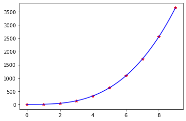
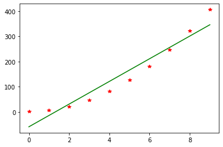
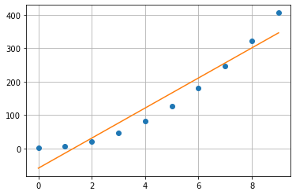

# The 'anm' Usage Examples

<table align="center" style ="font-size:2em;">
    <tr>
        <th style="text-align: center">code1</th>
        <th style="text-align: center">code2</th>
        <th style="text-align: center">code3</th>
        <th style="text-align: center">code4</th>
        <th style="text-align: center">code5</th>
        <th style="text-align: center">code6</th>
        <th style="text-align: center">code7</th>
    </tr>
    <tr>
        <td style="text-align: center"><a href="#bisect">bisect</a></td>
    </tr>
    <tr>
        <td style="text-align: center"><a href="#bisect2">bisect2</a></td>
    </tr>
    <tr>
        <td style="text-align: center"><a href="#false_position">false_position</a></td>
    </tr>
    <tr>
        <td style="text-align: center"><a href="#multiple1">multiple1</a></td>
    </tr>
    <tr>
        <td style="text-align: center"><a href="#multiple2">multiple2</a></td>
    </tr>
    <tr>
        <td style="text-align: center"><a href="#newtraph">newtraph</a></td>
    </tr>
</table>


```python
# import the essential python packages
import anm
import numpy as np
import matplotlib.pyplot as plt
```

---
## bisect


```python
f_x = lambda x: 1*x**3 + 4*x**2 - 1
root, fx, ea, iter = anm.bisect(func = f_x, xl = 0, xu = 1, es = 1e-4, maxit = 50)
print('xr: {}\nf(xr): {}\nea: {}\niter: {}'.format(root, fx, ea, iter))
```

    xr: 0.47283387184143066
    f(xr): -1.654603528633558e-07
    ea: 5.0423329059115807e-05
    iter: 22
    

## bisect2


```python
f_x = lambda x: 1*x**3 + 4*x**2 - 1
xr, f_xr = anm.bisect2(func = f_x)
print('\nxr: {}\nf(xr): {}'.format(xr, f_xr))
```

    enter lower bound xl = 0
    enter upper bound xu = 1
    allowable tolerance es = 1e-4
    maximum number of iteration maxit = 50
    
    Bisection method has converged
    
    step			xl			xu			xr			f(xr)
    1                       0.0                     1.0                     0.5                     0.125                   
    2                       0.0                     0.5                     0.25                    -0.734375               
    3                       0.25                    0.5                     0.375                   -0.384765625            
    4                       0.375                   0.5                     0.4375                  -0.150634765625         
    5                       0.4375                  0.5                     0.46875                 -0.018096923828125      
    6                       0.46875                 0.5                     0.484375                0.052120208740234375    
    7                       0.46875                 0.484375                0.4765625               0.016680240631103516    
    8                       0.46875                 0.4765625               0.47265625              -0.000791013240814209   
    9                       0.47265625              0.4765625               0.474609375             0.007923923432826996    
    10                      0.47265625              0.474609375             0.4736328125            0.003561285324394703    
    11                      0.47265625              0.4736328125            0.47314453125           0.0013838439481332898   
    12                      0.47265625              0.47314453125           0.472900390625          0.0002960923739010468   
    13                      0.47265625              0.472900390625          0.4727783203125         -0.0002475411729392363  
    14                      0.4727783203125         0.472900390625          0.47283935546875        2.4255414928120445e-05  
    
    xr: 0.47283935546875
    f(xr): 2.4255414928120445e-05
    

## false_position


```python
f_x = lambda x: 1*x**3 + 4*x**2 - 1
xr, f_xr = anm.false_position(func = f_x)
print('\nxr: {}\nf(xr): {}'.format(xr, f_xr))
```

    enter lower bound xl = 0
    enter upper bound xu = 1
    allowable tolerance es = 1e-4
    maximum number of iteration maxit = 50
    
    False position method has converged
    
    step			xl			xu			xr			f(xr)
    1                       0.0                     1.0                     0.19999999999999996     -0.8320000000000001     
    2                       0.19999999999999996     1.0                     0.3377483443708609      -0.5051759377348096     
    3                       0.3377483443708609      1.0                     0.4120081747909561      -0.2510583646739528     
    4                       0.4120081747909561      1.0                     0.4467337074501525      -0.11256088338190762    
    5                       0.4467337074501525      1.0                     0.46187661825458337     -0.04814781422136949    
    6                       0.46187661825458337     1.0                     0.4682769439841509      -0.02018150308871225    
    7                       0.4682769439841509      1.0                     0.4709462191124203      -0.008387312145726744   
    8                       0.4709462191124203      1.0                     0.4720532326958471      -0.003473351814168746   
    9                       0.4720532326958471      1.0                     0.47251127117914793     -0.0014362670460141835  
    10                      0.47251127117914793     1.0                     0.4727006068645838      -0.0005935496927956807  
    11                      0.4727006068645838      1.0                     0.4727788398539938      -0.00024522776512281297 
    
    xr: 0.4727788398539938
    f(xr): -0.00024522776512281297
    

## multiple1


```python
f_x = lambda x: 1*x**3 + 4*x**2 - 1
df_x = lambda x: x*(3*x + 8)
xr, f_xr = anm.multiple1(f_x, df_x)
print('\nxr: {}\nf(xr): {}'.format(xr, f_xr))
```

    Enter the multiplicity of the root = 1
    Enter the initial guess for x = 10
    Enter the allowable tolerance = 1e-4
    Enter the maximum number of iterations = 50
    
    Newton's method has converged.
    
    Step			x			f			df/dx
    1                       10.0                    1399.0                  380.0                   
    2                       6.318421052631579       410.93659281600816      170.31470221606648      
    3                       3.9056135411891355      119.59078328241583      77.00635972887291       
    4                       2.352614753771111       34.16042787003365       35.4253065691534        
    5                       1.3883202654976103      9.38562715421819        16.88886160275495       
    6                       0.8325914440424577      2.349993527376163       8.740357090417776       
    7                       0.56372445118784        0.45028434699107955     5.463151380103814       
    8                       0.48130236260523823     0.038102494692909605    4.545374793590058       
    9                       0.4729196666949599      0.0003819520743906235   4.4543163670002945      
    10                      0.4728339179418582      3.9842684262936245e-08  4.45338708540361        
    
    xr: 0.4728339179418582
    f(xr): 3.9842684262936245e-08
    

## multiple2


```python
f_x = lambda x: 1*x**3 + 4*x**2 - 1
df_x = lambda x: x*(3*x + 8)
ddf_x = lambda x: 6*x + 8
xr, f_xr = anm.multiple2(f_x, df_x, ddf_x)
print('\nxr: {}\nf(xr): {}'.format(xr, f_xr))
```

    Enter initial guess: xguess = 1
    Allowable tolerance es = 1e-4
    Maximum number of iterations: maxit = 50
    
    Newton method has converged
    
    Step			x			f			df/dx			d2f/dx2
    1                       1.0                     4.0                     11.0                    14.0                    
    2                       0.32307692307692304     -0.548762858443332      2.8977514792899406      9.938461538461539       
    3                       0.4378844314031371      -0.1490677228163223     4.078303777020842       10.627306588418822      
    4                       0.4712572039325127      -0.007008211341639647   4.436307688234971       10.827543223595075      
    5                       0.4728308761485578      -1.350639018160571e-05  4.453354121506701       10.836985256891346      
    6                       0.47283390898406397     -4.9840465088379915e-11 4.453386988327962       10.837003453904384      
    
    xr: 0.47283390898406397
    f(xr): -4.9840465088379915e-11
    

## newtraph


```python
f_x = lambda x: 1*x**3 + 4*x**2 - 1
df_x = lambda x: x*(3*x + 8)
root, ea, iter = anm.newtraph(func = f_x, dfunc = df_x, xr = 0.1, es = 1e-4, maxit = 50)
print('root: {}\nea: {}\niter: {}'.format(root, ea, iter))
```

    root: 0.4728339089952555
    ea: 1.425450195876832e-07
    iter: 7
    

---
## Cubic_LS


```python
a = np.array(range(10)).astype(np.float64)
b = 1+5*a**3
z, Syx, r = anm.Cubic_LS(a,b)
print('coef_: {}\nStandard Error: {}\ncorr: {}'.format(z, Syx, r))
```


    

    


    ---------------------------------------------------------------------------

    TypeError                                 Traceback (most recent call last)

    Input In [4], in <cell line: 4>()
          2 a = np.array(range(10)).astype(np.float64)
          3 b = 1+5*a**3
    ----> 4 z, Syx, r = anm.Cubic_LS(a,b)
          5 print('coef_: {}\nStandard Error: {}\ncorr: {}'.format(z, Syx, r))
    

    TypeError: cannot unpack non-iterable NoneType object


```python
# Lagrange coefficient
a = np.array(range(10))
b = 1+5*a**3
c = anm.Lagrange_coef(a,b)
print('coef_: {}'.format(c))
```

    coef_: [-2.75573192e-06  1.48809524e-04 -4.06746032e-03  3.14814815e-02
     -1.11458333e-01  2.17361111e-01 -2.50231481e-01  1.70238095e-01
     -6.35168651e-02  1.00473986e-02]
    


```python
# Lagrange Evaluation
x = np.array([0, 1, 4, 3])
y = np.exp(x)
c = anm.Lagrange_coef(x,y)
t = [2]
p = anm.Lagrange_Eval(t,x,c)
print('f(t): {}'.format(p))
```

    f(t): [5.9361875]
    


```python
# Linear Least Square
x = np.array(range(10))
y = 1+5*x**2
[a1, a0], r = anm.Linear_LS(x,y)
print('coef_: {}\ncorr: {}'.format([a1, a0], r))
```

    	x	y	(a0+a1*x)	(y-a0-a1*x)
    	1	0	1	-59.0	60.0
    
    	2	1	6	-14.0	20.0
    
    	3	2	21	31.0	-10.0
    
    	4	3	46	76.0	-30.0
    
    	5	4	81	121.0	-40.0
    
    	6	5	126	166.0	-40.0
    
    	7	6	181	211.0	-30.0
    
    	8	7	246	256.0	-10.0
    
    	9	8	321	301.0	20.0
    
    	10	9	406	346.0	60.0
    
    


    

    


    coef_: [45.0, -59.0]
    corr: 0.9626907371412557
    


```python
# Linear Regression
x = np.array(range(10))
y = 1+5*x**2
[a0, a1], r2 = anm.linregr(x,y)
print('coef_: {}\ncorr: {}'.format([a0, a1], r2))
```

    coef_: [45.0, -59.0]
    corr: 0.9267734553775746
    


    

    


```python
# Quadratic
x = np.array([-1, 0, 2, 5, 6])
f = np.array([-5, 4, -2, 19, 58])
A, b = anm.quadratic(x, f)
print('A: {}\nb: {}'.format(A, b))
```

    A: [[ 1  0  0  0  0  0  0  0  0  0  0  0]
     [ 0  1  1  0  0  0  0  0  0  0  0  0]
     [ 0  0  0  1  0  0  0  0  0  0  0  0]
     [ 0  0  0  0  2  4  0  0  0  0  0  0]
     [ 0  0  0  0  0  0  1  0  0  0  0  0]
     [ 0  0  0  0  0  0  0  3  9  0  0  0]
     [ 0  0  0  0  0  0  0  0  0  1  0  0]
     [ 0  0  0  0  0  0  0  0  0  0  1  1]
     [ 0  1  2  0 -1  0  0  0  0  0  0  0]
     [ 0  0  0  0  1  4  0 -1  0  0  0  0]
     [ 0  0  0  0  0  0  0  1  6  0 -1  0]
     [ 0  0  1  0  0  0  0  0  0  0  0  0]]
    b: [-5, 9, 4, -6, -2, 21, 19, 39, 0, 0, 0, 0]
    


```python
# Quadratic Least Square
x = np.array(range(10)).astype(np.float64)
y = 1+5*x**2
z, Syx, r = anm.Quadratic_LS(x,y)
print('coef_: {}\nSyx: {}\ncorr:{}'.format(z, Syx, r))
```

    	x	y	(a0+a1*x+a2*x**2)	(y-a0-a1*x-a2*x**2)
    	1	0.0	1.0	1.0000000000000233	-2.3314683517128287e-14
    
    	2	1.0	6.0	6.0000000000000195	-1.9539925233402755e-14
    
    	3	2.0	21.0	21.000000000000018	-1.7763568394002505e-14
    
    	4	3.0	46.0	46.000000000000014	-1.4210854715202004e-14
    
    	5	4.0	81.0	81.00000000000001	-1.4210854715202004e-14
    
    	6	5.0	126.0	126.0	-1.4210854715202004e-14
    
    	7	6.0	181.0	181.0	0.0
    
    	8	7.0	246.0	246.0	0.0
    
    	9	8.0	321.0	321.0	0.0
    
    	10	9.0	406.0	406.0	5.684341886080802e-14
    
    


    

    


    coef_: [ 1.0000000e+00 -3.2728029e-15  5.0000000e+00]
    Syx: 2.6933640544107207e-14
    corr:1.0
    
