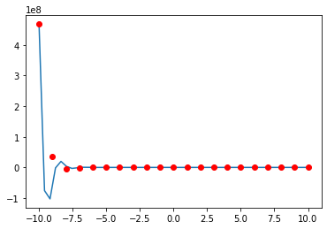
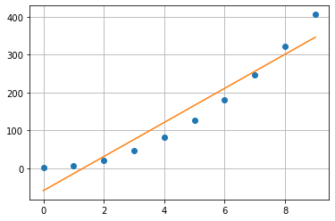
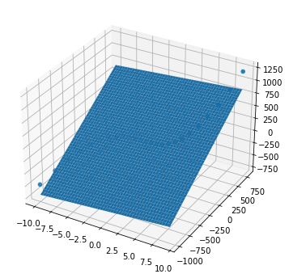
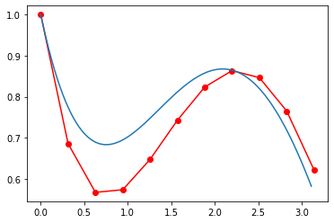
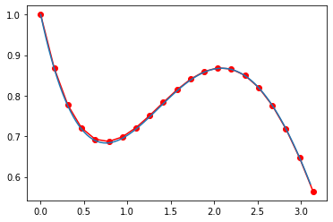
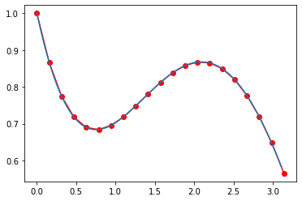
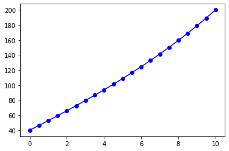

# ANM Usage Guide

## [Additional Resources](./another-page.html)


[](https://github.com/suryapusapati/Advanced-Numerical-Method/)

<table align="center" style ="font-size:1.2em;">
    <tr>
        <th style="text-align: center">code1</th>
        <th style="text-align: center">code2</th>
        <th style="text-align: center">code3</th>
        <th style="text-align: center">code4</th>
        <th style="text-align: center">code5</th>
        <th style="text-align: center">code6</th>
        <th style="text-align: center">code7</th>
    </tr>
    <tr>
        <td style="text-align: center"><a href="#bisect">bisect</a></td>
        <td style="text-align: center"><a href="#cubic_ls">Cubic_LS</a></td>
        <td style="text-align: center"><a href="#cholesky">Cholesky</a></td>
        <td style="text-align: center"><a href="#fixed_pt_sys">fixed_pt_sys</a></td>
        <td style="text-align: center"><a href="#gauss_quad">Gauss_quad</a></td>
        <td style="text-align: center"><a href="#euler_sys">Euler_sys</a></td>
        <td style="text-align: center"><a href="#example1_f">example1_f</a></td>
    </tr>
    <tr>
        <td style="text-align: center"><a href="#bisect2">bisect2</a></td>
        <td style="text-align: center"><a href="#gauss_newton">Gauss_Newton</a></td>
        <td style="text-align: center"><a href="#gaussnaive">GaussNaive</a></td>
        <td style="text-align: center"><a href="#gaussseidel">GaussSeidel</a></td>
        <td style="text-align: center"><a href="#quadadapt">quadadapt</a></td>
        <td style="text-align: center"><a href="#eulode">eulode</a></td>
        <td style="text-align: center"><a href="#example3_f">example3_f</a></td>
    </tr>
    <tr>
        <td style="text-align: center"><a href="#false_position">false_position</a></td>
        <td style="text-align: center"><a href="#lagrange_coef">Lagrange_coef</a></td>
        <td style="text-align: center"><a href="#gausspivot">GaussPivot</a></td>
        <td style="text-align: center"><a href="#invpower">InvPower</a></td>
        <td style="text-align: center"><a href="#romberg">romberg</a></td>
        <td style="text-align: center"><a href="#example2_e">example2_e</a></td>
        <td style="text-align: center"><a href="#linear_fd">linear_FD</a></td>
    </tr>
    <tr>
        <td style="text-align: center"><a href="#multiple1">multiple1</a></td>
        <td style="text-align: center"><a href="#lagrange_eval">Lagrange_Eval</a></td>
        <td style="text-align: center"><a href="#lu_factor">LU_factor</a></td>
        <td style="text-align: center"><a href="#lu_solve_gen">LU_Solve_Gen</a></td>
        <td style="text-align: center"><a href="#simp">Simp</a></td>
        <td style="text-align: center"><a href="#example2_f">example2_f</a></td>
        <td style="text-align: center"><a href="#shoot_secant">shoot_secant</a></td>
    </tr>
    <tr>
        <td style="text-align: center"><a href="#multiple2">multiple2</a></td>
        <td style="text-align: center"><a href="#linear_ls">Linear_LS</a></td>
        <td style="text-align: center"><a href="#lu_pivot">LU_pivot</a></td>
        <td style="text-align: center"><a href="#newton_sys">Newton_sys</a></td>
        <td style="text-align: center"><a href="#trap">trap</a></td>
        <td style="text-align: center"><a href="#example3">example3</a></td>
        <td></td>
    </tr>
    <tr>
        <td style="text-align: center"><a href="#newtraph">newtraph</a></td>
        <td style="text-align: center"><a href="#linregr">linregr</a></td>
        <td style="text-align: center"><a href="#lu_solve">LU_Solve</a></td>
        <td style="text-align: center"><a href="#power_eig">Power_eig</a></td>
        <td style="text-align: center"><a href="#trapuneq">trapuneq</a></td>
        <td style="text-align: center"><a href="#example5">example5</a></td>
        <td></td>
    </tr>
    <tr>
        <td></td>
        <td style="text-align: center"><a href="#multiple_linear">Multiple_Linear</a></td>
        <td style="text-align: center"><a href="#tridiag">Tridiag</a></td>
        <td style="text-align: center"><a href="#sor">SOR</a></td>
        <td></td>
        <td style="text-align: center"><a href="#heun_iter">Heun_iter</a></td>
        <td></td>
    </tr>
    <tr>
        <td></td>
        <td style="text-align: center"><a href="#newtint2">Newtint2</a></td>
        <td style="text-align: center"><a href="#truss">Truss</a></td>
        <td></td>
        <td></td>
        <td style="text-align: center"><a href="#midpoint">Midpoint</a></td>
        <td></td>
    </tr>
    <tr>
        <td></td>
        <td style="text-align: center"><a href="#quadratic">quadratic</a></td>
        <td></td>
        <td></td>
        <td></td>
        <td style="text-align: center"><a href="#rk4">RK4</a></td>
        <td></td>
    </tr>
    <tr>
        <td></td>
        <td style="text-align: center"><a href="#quadratic_ls">Quadratic_LS</a></td>
        <td></td>
        <td></td>
        <td></td>
        <td style="text-align: center"><a href="#rk4_sys">RK4_sys</a></td>
        <td></td>
    </tr>
</table>

## Instructions of `anm`
- Download and move `anm.py` to package path or workspace
- create a new Python file `*.py` or Ipython Notebook `*.ipynb` in workspace
- start programing by importing `anm` and essential packages
```python
import anm
import numpy as np
import matplotlib.pyplot as plt
```
- Check the docstring for basic instructions
- Open docstring by placing your cursor on `anm` or anm modules such as `anm.linregr` and click `Shift` + `Tab`
- Get list of modules by placing your cursor to the end of `anm.` and click `Tab`

<p>
    
    
    
    
</p>


# ANM Guide


```python
# Import the essential python packages
import anm
import numpy as np
import matplotlib.pyplot as plt
```

<p style="text-align:right; font-size:1.8em;"><a href="#">⏏️</a></p>

---
## bisect


```python
f_x = lambda x: 1*x**3 + 4*x**2 - 1
root, fx, ea, iter = anm.bisect(func = f_x, xl = 0, xu = 1, es = 1e-4, maxit = 50)
print('xr: {}\nf(xr): {}\nea: {}\niter: {}'.format(root, fx, ea, iter))
```

    xr: 0.47283387184143066
    f(xr): -1.654603528633558e-07
    ea: 5.0423329059115807e-05
    iter: 22
    

<p style="text-align:right; font-size:1.8em;"><a href="#">⏏️</a></p>

## bisect2


```python
f_x = lambda x: 1*x**3 + 4*x**2 - 1
xr, f_xr = anm.bisect2(func = f_x)
print('\nxr: {}\nf(xr): {}'.format(xr, f_xr))
```

    enter lower bound xl = 0
    enter upper bound xu = 1
    allowable tolerance es = 1e-4
    maximum number of iteration maxit = 50
    
    Bisection method has converged
    
    step	xl		xu		xr		f(xr)
    1	0.00000000	1.00000000	0.50000000	0.12500000
    2	0.00000000	0.50000000	0.25000000	-0.73437500
    3	0.25000000	0.50000000	0.37500000	-0.38476562
    4	0.37500000	0.50000000	0.43750000	-0.15063477
    5	0.43750000	0.50000000	0.46875000	-0.01809692
    6	0.46875000	0.50000000	0.48437500	0.05212021
    7	0.46875000	0.48437500	0.47656250	0.01668024
    8	0.46875000	0.47656250	0.47265625	-0.00079101
    9	0.47265625	0.47656250	0.47460938	0.00792392
    10	0.47265625	0.47460938	0.47363281	0.00356129
    11	0.47265625	0.47363281	0.47314453	0.00138384
    12	0.47265625	0.47314453	0.47290039	0.00029609
    13	0.47265625	0.47290039	0.47277832	-0.00024754
    14	0.47277832	0.47290039	0.47283936	0.00002426
    
    xr: 0.47283935546875
    f(xr): 2.4255414928120445e-05
    

<p style="text-align:right; font-size:1.8em;"><a href="#">⏏️</a></p>

## false_position


```python
f_x = lambda x: 1*x**3 + 4*x**2 - 1
xr, f_xr = anm.false_position(func = f_x)
print('\nxr: {}\nf(xr): {}'.format(xr, f_xr))
```

    enter lower bound xl = 0
    enter upper bound xu = 1
    allowable tolerance es = 1e-4
    maximum number of iteration maxit = 50
    
    False position method has converged
    
    step	xl		xu		xr		f(xr)
    1	0.00000000	1.00000000	0.20000000	-0.83200000
    2	0.20000000	1.00000000	0.33774834	-0.50517594
    3	0.33774834	1.00000000	0.41200817	-0.25105836
    4	0.41200817	1.00000000	0.44673371	-0.11256088
    5	0.44673371	1.00000000	0.46187662	-0.04814781
    6	0.46187662	1.00000000	0.46827694	-0.02018150
    7	0.46827694	1.00000000	0.47094622	-0.00838731
    8	0.47094622	1.00000000	0.47205323	-0.00347335
    9	0.47205323	1.00000000	0.47251127	-0.00143627
    10	0.47251127	1.00000000	0.47270061	-0.00059355
    11	0.47270061	1.00000000	0.47277884	-0.00024523
    
    xr: 0.4727788398539938
    f(xr): -0.00024522776512281297
    

<p style="text-align:right; font-size:1.8em;"><a href="#">⏏️</a></p>

## multiple1


```python
f_x = lambda x: 1*x**3 + 4*x**2 - 1
df_x = lambda x: x*(3*x + 8)
xr, f_xr = anm.multiple1(f_x, df_x)
print('\nxr: {}\nf(xr): {}'.format(xr, f_xr))
```

    Enter the multiplicity of the root = 1
    Enter the initial guess for x = 10
    Enter the allowable tolerance = 1e-4
    Enter the maximum number of iterations = 50
    
    Newton's method has converged.
    
    Step	x		f		df/dx
    1	10.00000000	1399.00000000	380.00000000
    2	6.31842105	410.93659282	170.31470222
    3	3.90561354	119.59078328	77.00635973
    4	2.35261475	34.16042787	35.42530657
    5	1.38832027	9.38562715	16.88886160
    6	0.83259144	2.34999353	8.74035709
    7	0.56372445	0.45028435	5.46315138
    8	0.48130236	0.03810249	4.54537479
    9	0.47291967	0.00038195	4.45431637
    10	0.47283392	0.00000004	4.45338709
    
    xr: 0.4728339179418582
    f(xr): 3.9842684262936245e-08
    

<p style="text-align:right; font-size:1.8em;"><a href="#">⏏️</a></p>

## multiple2


```python
f_x = lambda x: 1*x**3 + 4*x**2 - 1
df_x = lambda x: x*(3*x + 8)
ddf_x = lambda x: 6*x + 8
xr, f_xr = anm.multiple2(f_x, df_x, ddf_x)
print('\nxr: {}\nf(xr): {}'.format(xr, f_xr))
```

    Enter initial guess: xguess = 1
    Allowable tolerance es = 1e-4
    Maximum number of iterations: maxit = 50
    
    Newton method has converged
    
    Step	x		f		df/dx		d2f/dx2
    1	1.00000000	4.00000000	11.00000000	14.00000000
    2	0.32307692	-0.54876286	2.89775148	9.93846154
    3	0.43788443	-0.14906772	4.07830378	10.62730659
    4	0.47125720	-0.00700821	4.43630769	10.82754322
    5	0.47283088	-0.00001351	4.45335412	10.83698526
    6	0.47283391	-0.00000000	4.45338699	10.83700345
    
    xr: 0.47283390898406397
    f(xr): -4.9840465088379915e-11
    

<p style="text-align:right; font-size:1.8em;"><a href="#">⏏️</a></p>

## newtraph


```python
# Newton-Raphson method
f_x = lambda x: 1*x**3 + 4*x**2 - 1
df_x = lambda x: x*(3*x + 8)
root, ea, iter = anm.newtraph(func = f_x, dfunc = df_x, xr = 0.1, es = 1e-4, maxit = 50)
print('root: {}\nea: {}\niter: {}'.format(root, ea, iter))
```

    root: 0.4728339089952555
    ea: 1.425450195876832e-07
    iter: 7
    

<p style="text-align:right; font-size:1.8em;"><a href="#">⏏️</a></p>

---
## Cubic_LS


```python
# Least Square Cubic Equation
a = np.array(range(10)).astype(np.float64)
b = 1+5*a**3
z, Syx, r = anm.Cubic_LS(a,b)
print(f'y = {z[0]:.4f} + {z[1]:.4f} *x + {z[2]:.4f} *x**2 + {z[3]:.4f} *x**3\n\nStandard Error: {Syx}\n\ncorr: {r}')
```


    

    


    y = 1.0000 + -0.0000 *x + 0.0000 *x**2 + 5.0000 *x**3
    
    Standard Error: 2.050454164737037e-10
    
    corr: 1.0
    

<p style="text-align:right; font-size:1.8em;"><a href="#">⏏️</a></p>

## Gauss_Newton


```python
# Nonlinear Regression of f(x)=exp(-a0*x)cos(a1*x) using Gauss-Newton method
a = np.array(range(-10,10+1)).astype(np.float64)
b = np.exp(-2*a)*np.cos(5*a) # f(x)=exp(-a0*x)cos(a1*x)
a0, a1 = anm.Gauss_Newton(a, b)
print('f(x)=exp({:.1f}*x)*cos({:.1f}*x)'.format(a0, a1))
```

    Enter the initial guess of a0 = 1.5
    Enter the initial guess of a1 = 4.5
    Enter the tolerance to1 = 1e-4
    Enter the maximum iteration number itmax = 10
    
    iter	a0		a1		da0		da1
    0	1.87188241	-12.01705764	0.37188241	-16.51705764
    1	2.17941947	-11.93159922	0.30753706	0.08545841
    2	2.09424379	-11.95101275	-0.08517568	-0.01941353
    3	2.03479081	-11.97112615	-0.05945297	-0.02011340
    4	2.01178429	-11.98550069	-0.02300652	-0.01437454
    5	2.00992858	-11.98882560	-0.00185572	-0.00332491
    6	2.00997074	-11.98889115	0.00004216	-0.00006555
    
    Gauss-Newton method has converged
    
    


    

    


    f(x)=exp(2.0*x)*cos(-12.0*x)
    

<p style="text-align:right; font-size:1.8em;"><a href="#">⏏️</a></p>

## Lagrange_coef


```python
# Lagrange coefficient
a = np.array(range(-8,8+1))
b = 1+5*a**3
c = anm.Lagrange_coef(a,b)
print(f'coef: {c}')
```

    coef: [-1.27682557e-06  8.55157130e-07  6.21158512e-07 -4.82755097e-07
      2.29684201e-07  2.70680438e-07  2.31834945e-08  2.18708883e-09
      6.15118733e-10 -3.28063324e-09 -2.43723917e-08 -2.74720444e-07
     -2.31124227e-07  4.84302389e-07 -6.22309871e-07 -8.56154979e-07
      1.27782348e-06]
    

<p style="text-align:right; font-size:1.8em;"><a href="#">⏏️</a></p>

## Lagrange_Eval


```python
# Lagrange Evaluation
x = np.array([0, 1, 4, 3])
y = lambda x: np.exp(x)
c = anm.Lagrange_coef(x,y(x))
t = [2, 2.4, 2.6]
p = anm.Lagrange_Eval(t,x,c)
for i in range(len(t)):
    print('\nt = ',t[i])
    print('Lagr f(t): ',p[i])
    print('True f(t): ',y(t[i]))
```

    
    t =  2
    Lagr f(t):  5.936187495573769
    True f(t):  7.38905609893065
    
    t =  2.4
    Lagr f(t):  9.75597209973619
    True f(t):  11.023176380641601
    
    t =  2.6
    Lagr f(t):  12.510387425884225
    True f(t):  13.463738035001692
    

<p style="text-align:right; font-size:1.8em;"><a href="#">⏏️</a></p>

## Linear_LS


```python
# Least Square Linear Regression
x = np.array(range(10))
y = 1+5*x**2
[a0, a1], Syx, r = anm.Linear_LS(x,y)
print('y = {} + {} * x\nSyx: {}\nr2: {}'.format(float(a0), float(a1), Syx, r))
```

    x		y		(a0+a1*x)	(y-a0-a1*x)
    0.00000000	1.00000000	-59.00000000	60.00000000
    1.00000000	6.00000000	-14.00000000	20.00000000
    2.00000000	21.00000000	31.00000000	-10.00000000
    3.00000000	46.00000000	76.00000000	-30.00000000
    4.00000000	81.00000000	121.00000000	-40.00000000
    5.00000000	126.00000000	166.00000000	-40.00000000
    6.00000000	181.00000000	211.00000000	-30.00000000
    7.00000000	246.00000000	256.00000000	-10.00000000
    8.00000000	321.00000000	301.00000000	20.00000000
    9.00000000	406.00000000	346.00000000	60.00000000
    


    

    


    y = -59.0 + 45.0 * x
    Syx: 40.620192023179804
    r2: 0.9626907371412557
    

<p style="text-align:right; font-size:1.8em;"><a href="#">⏏️</a></p>

## linregr


```python
# Linear Regression
x = np.array(range(10))
y = 1+5*x**2
[a0, a1], r2 = anm.linregr(x,y)
print('y = {} + {} * x\nr2: {}'.format(float(a1), float(a0), r2))
```


    

    


    y = -59.0 + 45.0 * x
    r2: 0.9267734553775746
    

<p style="text-align:right; font-size:1.8em;"><a href="#">⏏️</a></p>

## Multiple_Linear


```python
# Multi-linear Regression
x1 = np.arange(-10,10,0.8)
x2 = np.arange(-10,10,0.8)**3+2
y = 1+5*x1**2+x2
a0, a1, a2, Syx, r = anm.Multiple_Linear(x1, x2, y)
print(f'y = {a0:.4f} + {a1:.4f}*x1 + {a2:.4f}*x2\nSyx: {Syx}\nr2: {r}')
```

    x1		x2		y		(a0+a1*x1+a2*x2)	(y-a0-a1*x1-a2*x2)
    -10.00000000	-998.00000000	-497.00000000	-705.92903226		208.92903226
    -9.20000000	-776.68800000	-352.48800000	-526.59552688		174.10752688
    -8.40000000	-590.70400000	-236.90400000	-374.67604301		137.77204301
    -7.60000000	-436.97600000	-147.17600000	-247.78675269		100.61075269
    -6.80000000	-312.43200000	-80.23200000	-143.54382796		63.31182796
    -6.00000000	-214.00000000	-33.00000000	-59.56344086		26.56344086
    -5.20000000	-138.60800000	-2.40800000	6.53823656		-8.94623656
    -4.40000000	-83.18400000	14.61600000	57.14503226		-42.52903226
    -3.60000000	-44.65600000	21.14400000	94.64077419		-73.49677419
    -2.80000000	-19.95200000	20.24800000	121.40929032		-101.16129032
    -2.00000000	-6.00000000	15.00000000	139.83440860		-124.83440860
    -1.20000000	0.27200000	8.47200000	152.29995699		-143.82795699
    -0.40000000	1.93600000	3.73600000	161.18976344		-157.45376344
    0.40000000	2.06400000	3.86400000	168.88765591		-165.02365591
    1.20000000	3.72800000	11.92800000	177.77746237		-165.84946237
    2.00000000	10.00000000	31.00000000	190.24301075		-159.24301075
    2.80000000	23.95200000	64.15200000	208.66812903		-144.51612903
    3.60000000	48.65600000	114.45600000	235.43664516		-120.98064516
    4.40000000	87.18400000	184.98400000	272.93238710		-87.94838710
    5.20000000	142.60800000	278.80800000	323.53918280		-44.73118280
    6.00000000	218.00000000	399.00000000	389.64086022		9.35913978
    6.80000000	316.43200000	548.63200000	473.62124731		75.01075269
    7.60000000	440.97600000	730.77600000	577.86417204		152.91182796
    8.40000000	594.70400000	948.50400000	704.75346237		243.75053763
    9.20000000	780.68800000	1204.88800000	856.67294624		348.21505376
    


    

    


    y = 163.4867 + 9.4982*x1 + 0.7760*x2
    Syx: 153.96086641447857
    r2: 0.9227306867620393
    

<p style="text-align:right; font-size:1.8em;"><a href="#">⏏️</a></p>

## Newtint2


```python
# Newton Interpolating Polynomial
x = np.linspace(10, 50, 50)
y = lambda x: x**2 + 10
xx = [30, 43.45]
b, yint = anm.Newtint2(x, y(x), xx)
for i in range(len(xx)):
    print('\nxx = ',xx[i])
    print('inter yy = ',yint[i])
    print('true  yy = ',y(xx[i]))
```

    
    xx =  30
    inter yy =  909.9999999999994
    true  yy =  910
    
    xx =  43.45
    inter yy =  1897.9024999999954
    true  yy =  1897.9025000000001
    

<p style="text-align:right; font-size:1.8em;"><a href="#">⏏️</a></p>

## quadratic


```python
# Quadratic
x = np.array([-1, 0, 2, 5, 6])
f = x**3 - 5*x**2 + 3*x + 4
print('f = ',f)
A, b = anm.quadratic(x, f)
print('\nA:\n{}\n\nb: {}'.format(A, b))
```

    f =  [-5  4 -2 19 58]
    
    A:
    [[ 1  0  0  0  0  0  0  0  0  0  0  0]
     [ 0  1  1  0  0  0  0  0  0  0  0  0]
     [ 0  0  0  1  0  0  0  0  0  0  0  0]
     [ 0  0  0  0  2  4  0  0  0  0  0  0]
     [ 0  0  0  0  0  0  1  0  0  0  0  0]
     [ 0  0  0  0  0  0  0  3  9  0  0  0]
     [ 0  0  0  0  0  0  0  0  0  1  0  0]
     [ 0  0  0  0  0  0  0  0  0  0  1  1]
     [ 0  1  2  0 -1  0  0  0  0  0  0  0]
     [ 0  0  0  0  1  4  0 -1  0  0  0  0]
     [ 0  0  0  0  0  0  0  1  6  0 -1  0]
     [ 0  0  1  0  0  0  0  0  0  0  0  0]]
    
    b: [-5  9  4 -6 -2 21 19 39  0  0  0  0]
    

<p style="text-align:right; font-size:1.8em;"><a href="#">⏏️</a></p>

## Quadratic_LS


```python
# Quadratic Least Square
x = np.array(range(10)).astype(np.float64)
y = 1+5*x**2
z, Syx, r = anm.Quadratic_LS(x,y)
print('y = {:.4f} + {:.4f} *x + {:.4f} *x**2\nSyx: {}\nr:{}'.format(float(z[0]), float(z[1]), float(z[2]), Syx, r))
```

    x		y		(a0+a1*x+a2*x**2)	(y-a0-a1*x-a2*x**2)
    0.00000000	1.00000000	1.00000000		-0.00000000
    1.00000000	6.00000000	6.00000000		-0.00000000
    2.00000000	21.00000000	21.00000000		-0.00000000
    3.00000000	46.00000000	46.00000000		-0.00000000
    4.00000000	81.00000000	81.00000000		-0.00000000
    5.00000000	126.00000000	126.00000000		-0.00000000
    6.00000000	181.00000000	181.00000000		0.00000000
    7.00000000	246.00000000	246.00000000		0.00000000
    8.00000000	321.00000000	321.00000000		0.00000000
    9.00000000	406.00000000	406.00000000		0.00000000
    


    

    


    y = 1.0000 + -0.0000 *x + 5.0000 *x**2
    Syx: 2.6933640544107207e-14
    r:1.0
    

<p style="text-align:right; font-size:1.8em;"><a href="#">⏏️</a></p>

---
## Cholesky


```python
# Cholesky Decomposition
A = np.array([[6,  15, 55],
              [15, 55, 225],
              [55, 225,979]]) # must be symmetric matrix
L, U = anm.Cholesky(A)
print('A :\n',A,'\n\nL :\n',L,'\n\nU :\n',U)
```

    A :
     [[  6  15  55]
     [ 15  55 225]
     [ 55 225 979]] 
    
    L :
     [[ 2.44948974  0.          0.        ]
     [ 6.12372436  4.18330013  0.        ]
     [22.45365598 20.91650066  6.11010093]] 
    
    U :
     [[ 2.44948974  6.12372436 22.45365598]
     [ 0.          4.18330013 20.91650066]
     [ 0.          0.          6.11010093]]
    


```python
# test
L @ U # dot product
```


    array([[  6.,  15.,  55.],
           [ 15.,  55., 225.],
           [ 55., 225., 979.]])


<p style="text-align:right; font-size:1.8em;"><a href="#">⏏️</a></p>

## GaussNaive


```python
# Naive Gauss elimination
# solving equations: 5x + 3y = 7, 3x - 5y = -23
A = np.array([[5, 3],
              [3, -5]])
b = np.array([7, -23])
x = anm.GaussNaive(A, b)
print(f'x = {x[0]:f} \ny = {x[1]:f}')
```

    x = -1.000000 
    y = 4.000000
    

<p style="text-align:right; font-size:1.8em;"><a href="#">⏏️</a></p>

## GaussPivot


```python
# Gauss elimination with pivoting
# solving equations: 5x + 3y = 7, 3x - 5y = -23
A = np.array([[5, 3],
              [3, -5]])
b = np.array([7, -23])
x = anm.GaussPivot(A, b)
print(f'x = {x[0]:f} \ny = {x[1]:f}')
```

    x = -1.300000 
    y = 4.500000
    

<p style="text-align:right; font-size:1.8em;"><a href="#">⏏️</a></p>

## LU_factor


```python
# Direct LU factorization
A = np.array([[-19, 20, -6],
              [-12, 13, -3],
              [30, -30, 12]])
L, U = anm.LU_factor(A)
print('L :\n',L,'\n\nU :\n',U)
```

    L :
     [[ 1.          0.          0.        ]
     [ 0.63157895  1.          0.        ]
     [-1.57894737  4.28571429  1.        ]] 
    
    U :
     [[-19.          20.          -6.        ]
     [  0.           0.36842105   0.78947368]
     [  0.           0.          -0.85714286]]
    

<p style="text-align:right; font-size:1.8em;"><a href="#">⏏️</a></p>

## LU_pivot


```python
# Pivot LU factorization
A = np.array([[-19, 20, -6],
              [-12, 13, -3],
              [30, -30, 12]])
L, U, P = anm.LU_pivot(A)
print('A :\n',A,'\n\nL :\n',L,'\n\nU :\n',U,'\n\nP :\n',P,'\n\nL*U :\n',L@U,'\n\nP*A :\n',P@A)
```

    A :
     [[-19  20  -6]
     [-12  13  -3]
     [ 30 -30  12]] 
    
    L :
     [[ 1.          0.          0.        ]
     [-0.4         1.          0.        ]
     [-0.63333333  1.          1.        ]] 
    
    U :
     [[ 30 -30  12]
     [  0   1   1]
     [  0   0   0]] 
    
    P :
     [[0. 0. 1.]
     [0. 1. 0.]
     [1. 0. 0.]] 
    
    L*U :
     [[ 30.  -30.   12. ]
     [-12.   13.   -3.8]
     [-19.   20.   -6.6]] 
    
    P*A :
     [[ 30. -30.  12.]
     [-12.  13.  -3.]
     [-19.  20.  -6.]]
    

<p style="text-align:right; font-size:1.8em;"><a href="#">⏏️</a></p>

## LU_Solve


```python
#
# x = anm.LU_Solve(L, U, P)
```

<p style="text-align:right; font-size:1.8em;"><a href="#">⏏️</a></p>

## Tridiag


```python
# Tridiagonal matrix
e = np.array([0, -2, 4, -0.5, 1.5, -3])
f = np.array([1, 6, 9, 3.25, 1.75, 13])
g = np.array([-2, 4, -0.5, 1.5, -3, 0])
r = np.array([-3, 22, 35.5, -7.75, 4, -33])
anm.Tridiag(e, f, g, r)
```


    [1.0, 2.0, 3.0, -1.0, -2.0, -3.0]


<p style="text-align:right; font-size:1.8em;"><a href="#">⏏️</a></p>

## Truss


```python
# Truss
A, b, f = anm.Truss(alpha = np.pi/6, beta = np.pi/3, gamma = np.pi/4, delta = np.pi/3)
print('A :\n',A,'\n\nb :\n',b,'\n\nf :\n',f)
```

    A :
     [[ 1.          0.          0.          0.          0.5         0.
       0.          0.          0.          0.        ]
     [ 0.          1.          0.          1.          0.8660254   0.
       0.          0.          0.          0.        ]
     [ 0.          0.          0.          0.          0.          0.
       0.8660254   0.70710678  0.          0.        ]
     [ 0.          0.          0.         -1.          0.          1.
      -0.5         0.70710678  0.          0.        ]
     [ 0.          0.          1.          0.          0.          0.
       0.          0.          0.70710678  0.        ]
     [ 0.          0.          0.          0.          0.         -1.
       0.          0.         -0.5         0.        ]
     [ 0.          0.          0.          0.         -0.5         0.
      -0.8660254   0.          0.          0.        ]
     [ 0.          0.          0.          0.         -0.8660254   0.
       0.5         0.          0.          1.        ]
     [ 0.          0.          0.          0.          0.          0.
       0.         -0.70710678 -0.8660254   0.        ]
     [ 0.          0.          0.          0.          0.          0.
       0.         -0.70710678  0.5        -1.        ]] 
    
    b :
     [[  0.]
     [  0.]
     [100.]
     [  0.]
     [  0.]
     [  0.]
     [  0.]
     [  0.]
     [  0.]
     [  0.]] 
    
    f :
     [[ 4.05827420e+01]
     [ 2.84217094e-14]
     [ 4.85139880e+01]
     [ 7.02913710e+01]
     [-8.11654839e+01]
     [ 3.43045699e+01]
     [ 4.68609140e+01]
     [ 8.40286922e+01]
     [-6.86091399e+01]
     [-9.37218280e+01]]
    

<p style="text-align:right; font-size:1.8em;"><a href="#">⏏️</a></p>

---
## fixed_pt_sys


```python
# Fixed-point method
def fp_examp_1(x):
    return np.array([-0.02*x[0]**2 - 0.02*x[1]**2 - 0.02*x[2]**2 + 4,
                     -0.05*x[0]**2 - 0.05*x[2]**2 + 2.5,
                     -0.025*x[0]**2 + 0.025*x[1]**2 - 1.875])
x = anm.fixed_pt_sys(fp_examp_1, x0 = [0, 0, 0], es = 1e-4, maxit = 50)
print('x :',x)
```

    iter	 x[0]		x[1]		x[2] 		diff
    1	 4.00000000	2.50000000	-1.87500000 	5.07598513
    2	 3.48468750	1.52421875	-2.11875000 	1.13009295
    3	 3.62089217	1.66839257	-2.12049510 	0.19834528
    4	 3.59218213	1.61963202	-2.13318316 	0.05799004
    5	 3.59845099	1.62728786	-2.13201411 	0.00996379
    6	 3.59715201	1.62528332	-2.13251959 	0.00244152
    7	 3.59742623	1.62564288	-2.13244892 	0.00045769
    8	 3.59736943	1.62555930	-2.13246902 	0.00010303
    9	 3.59738132	1.62557545	-2.13246559 	0.00002035
    
    Fixed-point iteration has converged
    
    x : [ 3.59738132  1.62557545 -2.13246559]
    

<p style="text-align:right; font-size:1.8em;"><a href="#">⏏️</a></p>

## GaussSeidel


```python
# Gauss Seidel method
A = np.array([[4, -1, -1], [6, 8, 0], [-5, 0, 12]], dtype=float)
b = np.array([-2, 45, 80])
x = anm.GaussSeidel(A, b, es=0.00001, maxit=50)
for i in range(len(x)):
    print(f'x{str(i+1)}: {float(x[i]):.8}')
```

    iter	x[0]		x[1]		x[2]
    1 	 2.61458333	3.66406250	7.75607639
    2 	 2.35503472	3.85872396	7.64793113
    3 	 2.37666377	3.84250217	7.65694324
    4 	 2.37486135	3.84385399	7.65619223
    5 	 2.37501155	3.84374133	7.65625481
    6 	 2.37499904	3.84375072	7.65624960
    7 	 2.37500008	3.84374994	7.65625003
    8 	 2.37499999	3.84375001	7.65625000
    
    Gauss Serdel method has converged
    
    x1: 2.375
    x2: 3.84375
    x3: 7.65625
    

<p style="text-align:right; font-size:1.8em;"><a href="#">⏏️</a></p>

## InvPower


```python
# Inverse Power Method
A = np.array([[2, 8, 10], [8, 3, 4], [10, 4, 7]])
z, m, error = anm.InvPower(A, max_it = 100, tol = 1e-3)
print('\nz :\n',z,'\n\nm :',float(m),'\n\nerror :',error)
```

    iter	m		z[0]		z[1]		z[2]
    1 	12.78260870	0.30000000	1.00000000	-0.53333333
    2 	0.71234406	0.12048504	1.00000000	-0.80134159
    3 	0.66865130	0.11674049	1.00000000	-0.81523988
    4 	0.66859469	0.11630856	1.00000000	-0.81545592
    
    z :
     [[ 0.11630856]
     [ 1.        ]
     [-0.81545592]] 
    
    m : 0.6685946897500895 
    
    error : 0.0003163103147705191
    

<p style="text-align:right; font-size:1.8em;"><a href="#">⏏️</a></p>

## LU_Solve_Gen


```python
# Solve the equation using LUx=B
A = np.array([[-19, 20, -6],
              [-12, 13, -3],
              [30, -30, 12]])
L, U = anm.LU_factor(A)
B = np.eye(3)
x = anm.LU_Solve_Gen(L, U, B)
print('Inverse from LU_Solve_Gen :\n',x,'\n\nInverse of A :\n',np.linalg.inv(A))
```

    Inverse from LU_Solve_Gen :
     [[ 11.         -10.           3.        ]
     [  9.          -8.           2.5       ]
     [ -5.           5.          -1.16666667]] 
    
    Inverse of A :
     [[ 11.         -10.           3.        ]
     [  9.          -8.           2.5       ]
     [ -5.           5.          -1.16666667]]
    

<p style="text-align:right; font-size:1.8em;"><a href="#">⏏️</a></p>

## Newton_sys


```python
# Solve the nonlinear system F(x) = 0 using Newton's method
def example_1(x):
    return np.array([x[0]**2 + x[1]**2 - 1,
                     x[0]**2 - x[1]])
def examp_1_j(x):
    return np.array([[2*x[0], 2*x[1]],
                     [2*x[0], -1]])
x = anm.Newton_sys(example_1, examp_1_j, x0 = [0.5, 0.5], tol = 1e-6, maxit = 100)
print(f'x1 = {x[0]:f} \nx2 = {x[1]:f}')
```

    iter	x[0]		x[1]		diff
    1 	 0.87500000	0.62500000 	0.39528471
    2 	 0.79067460	0.61805556 	0.08461086
    3 	 0.78616432	0.61803399 	0.00451034
    4 	 0.78615138	0.61803399 	0.00001294
    5 	 0.78615138	0.61803399 	0.00000000
    
    Newton method has converged
    
    x1 = 0.786151 
    x2 = 0.618034
    

<p style="text-align:right; font-size:1.8em;"><a href="#">⏏️</a></p>

## Power_eig


```python
# Power Method for finding eigenvalues
A = np.array([[2, 8, 10],[8, 3, 4],[10, 4, 7]])
z, m, error = anm.Power_eig(A, max_it = 100, tol = 1e-3)
print(f'\nz :{z.T}\nm : {float(m):.8f}\nerror : {error:.8f}')
```

    iter	m		z[0]		z[1]		z[2]
    1	21.000000	0.95238095	0.71428571	1.00000000	
    2	19.380952	0.90909091	0.71007371	1.00000000	
    3	18.931204	0.92433485	0.70798183	1.00000000	
    4	19.075276	0.91807450	0.70869876	1.00000000	
    5	19.015540	0.92060173	0.70840440	1.00000000	
    6	19.039635	0.91957849	0.70852341	1.00000000	
    7	19.029879	0.91999243	0.70847526	1.00000000	
    8	19.033825	0.91982492	0.70849474	1.00000000	
    9	19.032228	0.91989270	0.70848686	1.00000000	
    
    z :[[0.9198927  0.70848686 1.        ]]
    m : 19.03222820
    error : 0.00083175
    

<p style="text-align:right; font-size:1.8em;"><a href="#">⏏️</a></p>

## SOR


```python
# Successive Over Relaxation (SOR)
A = np.array([[4, -1, -1],
              [6, 8, 0],
              [-5, 0, 12]], dtype = float)
b = np.array([-2, 45, 80], dtype = float)
x0 = np.array([0, 0, 0], dtype = float)
w = 1.2
anm.SOR(A, b, x0 = x0, w = w, tol = 1e-6, max_it = 100)
```

    iter	x0		x1		x2		
    1	-0.60000000	7.83000000	7.10000000
    2	1.40450000	2.65590000	8.68675000
    3	0.38616000	5.52373200	6.84189000
    4	0.83551680	4.14132336	7.88489720
    5	0.64258486	4.76508257	7.38689786
    6	0.72493520	4.49210013	7.61002323
    7	0.68983030	4.60988543	7.51274081
    8	0.70479083	4.55939941	7.55463809
    9	0.69841555	4.58097212	7.53669571
    10	0.70113228	4.57176747	7.54435928
    11	0.69997459	4.57569224	7.54109003
    12	0.70046792	4.57401930	7.54248387
    13	0.70025770	4.57473229	7.54188977
    14	0.70034728	4.57442844	7.54214297
    15	0.70030911	4.57455792	7.54203507
    16	0.70032537	4.57450274	7.54208105
    17	0.70031844	4.57452626	7.54206145
    18	0.70032140	4.57451624	7.54206980
    19	0.70032014	4.57452051	7.54206624
    20	0.70032067	4.57451869	7.54206776
    21	0.70032044	4.57451946	7.54206711
    
    SOR method converged
    
    


    array([0.70032054, 4.57451913, 7.54206739])


<p style="text-align:right; font-size:1.8em;"><a href="#">⏏️</a></p>

---
## Gauss_quad


```python
# Gauss Quadrature
def example1(x):
    return x**2*np.sin(2*x)
anm.Gauss_quad(f = example1 , a = 0, b = np.pi, k = 2)
```


    -8.00265438638611


<p style="text-align:right; font-size:1.8em;"><a href="#">⏏️</a></p>

## quadadapt


```python
# Adaptive Quadrature Formulation
def example1(x):
    return x**2*np.sin(2*x)
anm.quadadapt(f = example1, a = 0, b = np.pi)
```


    -4.934802202223205


<p style="text-align:right; font-size:1.8em;"><a href="#">⏏️</a></p>

## romberg


```python
# Romberg Integration
def example1(x):
    return x**2*np.sin(2*x)
q, ea, iter = anm.romberg(func = example1, a = 0, b = np.pi, es = 1e-6, maxit = 50)
print(f'q : {q}\nea : {ea}\niter : {iter}')
```

    q : -4.93480220056642
    ea : 3.7448974908415425e-10
    iter : 6
    

<p style="text-align:right; font-size:1.8em;"><a href="#">⏏️</a></p>

## Simp


```python
# Composite Simpson's Rule
def example2(x):
    return x*np.exp(2*x)
anm.Simp(f = example2, a = 0, b = 4, n = 2)
```


    8240.411432288045


```python
anm.Simp(f = example2, a = 0, b = 4, n = 4)
```


    5670.9754315360115


```python
anm.Simp(f = example2, a = 0, b = 4, n = 8)
```


    5256.753502612332


```python
anm.Simp(f = example2, a = 0, b = 4, n = 16)
```


    5219.6754602990595


<p style="text-align:right; font-size:1.8em;"><a href="#">⏏️</a></p>

## trap


```python
# Composite Trapezoidal Rule
def example2(x):
    return x*np.exp(2*x)
anm.trap(func = example2, a = 0, b = 4, n = 1)
```


    23847.663896333826


```python
anm.trap(func = example2, a = 0, b = 4, n = 2)
```


    12142.22454829949


```python
anm.trap(func = example2, a = 0, b = 4, n = 4)
```


    7288.787710726881


```python
anm.trap(func = example2, a = 0, b = 4, n = 8)
```


    5764.762054640969


```python
anm.trap(func = example2, a = 0, b = 4, n = 16)
```


    5355.947108884538


<p style="text-align:right; font-size:1.8em;"><a href="#">⏏️</a></p>

## trapuneq


```python
# Trapezoidal Rule for Unequally spaced data
x = np.array([0, 1, 1.5, 2.0, 2.5, 3.0, 3.3, 3.6, 3.8, 3.9, 4.0])
y = lambda x: x*np.exp(2*x)
anm.trapuneq(x, y(x))
```


    5365.065050065013


<p style="text-align:right; font-size:1.8em;"><a href="#">⏏️</a></p>

---
## Euler_sys


```python
# Euler's Method for a System of ODEs
def example5(t, y):
    f1 = -0.5*y[0]
    f2 = 4 - 0.1*y[0] - 0.3*y[1]
    return np.array([f1, f2]).T
t, y = anm.Euler_sys(f = example5, tspan = np.array([0, 1]), y0 = np.array([4, 6]), h = 0.5)
print(f'\nt : {t}\ny : {y}')
```

    t	y0		y1
    0.0	4.00000000	6.00000000
    0.5	3.00000000	6.90000000
    1.0	2.25000000	7.71500000
    
    t : 1.0
    y : [2.25  7.715]
    


```python
t, y = anm.Euler_sys(f = example5, tspan = np.array([0, 1]), y0 = np.array([4, 6]), h = 0.2)
print(f'\nt : {t}\ny : {y}')
```

    t	y0		y1
    0.0	4.00000000	6.00000000
    0.2	3.60000000	6.36000000
    0.4	3.24000000	6.70640000
    0.6	2.91600000	7.03921600
    0.8	2.62440000	7.35854304
    1.0	2.36196000	7.66454246
    
    t : 1.0
    y : [2.36196    7.66454246]
    

<p style="text-align:right; font-size:1.8em;"><a href="#">⏏️</a></p>

## eulode


```python
# Euler's method to integrate an ODE
dydt = lambda t,y: np.sin(t)-y
t, y = anm.eulode(dydt, tspan = np.array([0, np.pi]), y0 = 1, h = 0.1*np.pi)
```

    step	t		y
    1	0.00000000	1.00000000
    2	0.31415927	0.68584073
    3	0.62831853	0.56745807
    4	0.94247780	0.57384404
    5	1.25663706	0.64772580
    6	1.57079633	0.74301996
    7	1.88495559	0.82375262
    8	2.19911486	0.86374632
    9	2.51327412	0.84655259
    10	2.82743339	0.76525844
    11	3.14159265	0.62192596
    


```python
tt = np.arange(0,np.pi,0.01*np.pi)
ye = 1.5*np.exp(-tt)+0.5*np.sin(tt)-0.5*np.cos(tt)
plt.plot(t, y, 'r-o', tt, ye)
plt.show()
```


    

    


<p style="text-align:right; font-size:1.8em;"><a href="#">⏏️</a></p>

## example2_e


```python
# Compute: 1.5 * np.exp(-t) + 0.5 * np.sin(t) - 0.5 * np.cos(t)
anm.example2_e(t = 1.25)
```


    0.7465883237704438


```python
# Alternative
def example2_e(t):
    return 1.5 * np.exp(-t) + 0.5 * np.sin(t) - 0.5 * np.cos(t)
```

<p style="text-align:right; font-size:1.8em;"><a href="#">⏏️</a></p>

## example2_f


```python
# Compute: np.sin(t) - y
anm.example2_f(t = 0, y = 1)
```


    -1.0


```python
# Alternative
def example2_f(t, y):
    return np.sin(t) - y
```

<p style="text-align:right; font-size:1.8em;"><a href="#">⏏️</a></p>

## example3


```python
# Compute: t * y**0.5
anm.example3(t = 1, y = 2)
```


    1.4142135623730951


```python
# Alternative
def example3(t, y):
    return t * y**0.5
```

<p style="text-align:right; font-size:1.8em;"><a href="#">⏏️</a></p>

## example5


```python
# Compute: [(-0.5 * y[0]), (4 - 0.1 * y[0] - 0.3 * y[1])]
anm.example5(y = [0.2, 0.3])
```


    array([-0.1 ,  3.89])


```python
# Alternative
def example5(y):
    f1 = -0.5 * y[0]
    f2 = 4 - 0.1 * y[0] - 0.3 * y[1]
    return np.array([f1, f2], dtype=float)
```

<p style="text-align:right; font-size:1.8em;"><a href="#">⏏️</a></p>

## Heun_iter


```python
# Heun's iterative method (second order RK)
t, y = anm.Heun_iter(anm.example2_f, tspan = [0, np.pi], y0 = 1, h = 0.1*np.pi, itmax = 0) # without iteration
print(f'\nt : {t[-1]}\ny(t) : {y[-1]}')
```

    t		y(t)
    0.00000000	1.00000000
    0.31415927	0.78372903
    0.62831853	0.70180876
    0.94247780	0.70636506
    1.25663706	0.75585996
    1.57079633	0.81523823
    1.88495559	0.85647720
    2.19911486	0.85921135
    2.51327412	0.81116832
    2.82743339	0.70822516
    3.14159265	0.55397007
    
    t : 3.141592653589793
    y(t) : 0.5539700698900489
    


```python
t, y = anm.Heun_iter(anm.example2_f, tspan = [0, np.pi], y0 = 1, h = 0.1*np.pi, itmax = 5) # with iteration
print(f'\nt : {t[-1]}\ny(t) : {y[-1]}')
```

    t		y(t)
    0.00000000	1.00000000
    0.31415927	0.77043891
    0.62831853	0.68300141
    0.94247780	0.68718208
    1.25663706	0.73954394
    1.57079633	0.80361619
    1.88495559	0.85029235
    2.19911486	0.85836862
    2.51327412	0.81493619
    2.82743339	0.71541849
    3.14159265	0.56312591
    
    t : 3.141592653589793
    y(t) : 0.563125910960438
    

<p style="text-align:right; font-size:1.8em;"><a href="#">⏏️</a></p>

## Midpoint


```python
# Midpoint method (second order RK)
t, y = anm.midpoint(anm.example2_f, tspan = [0, np.pi], y0 = 1, h = 0.05*np.pi)
print(f'\nt : {t[-1]}\ny(t) : {y[-1]}')
```

    step	t		y(t)
    1	0.00000000	1.00000000
    2	0.15707963	0.86758170
    3	0.31415927	0.77674522
    4	0.47123890	0.72061651
    5	0.62831853	0.69278558
    6	0.78539816	0.68727353
    7	0.94247780	0.69851646
    8	1.09955743	0.72136291
    9	1.25663706	0.75108125
    10	1.41371669	0.78337410
    11	1.57079633	0.81439677
    12	1.72787596	0.84077724
    13	1.88495559	0.85963533
    14	2.04203522	0.86859892
    15	2.19911486	0.86581568
    16	2.35619449	0.84995869
    17	2.51327412	0.82022492
    18	2.67035376	0.77632578
    19	2.82743339	0.71846924
    20	2.98451302	0.64733328
    21	3.14159265	0.56403095
    
    t : 3.141592653589793
    y(t) : 0.5640309524346758
    


```python
tt = np.arange(0,np.pi,0.01*np.pi)
ye = 1.5*np.exp(-tt)+0.5*np.sin(tt)-0.5*np.cos(tt)
plt.plot(t, y, 'r-o', tt, ye)
plt.show()
```


    

    


<p style="text-align:right; font-size:1.8em;"><a href="#">⏏️</a></p>

## RK4


```python
# Fouth-Order Runge-Kutta Method (RK4)
t, y = anm.RK4(anm.example2_f, tspan = [0, np.pi], y0 = 1, h = 0.05*np.pi)
print(f'\nt : {t[-1]}\ny(t) : {y[-1]}')
```

    step	t		y(t)
    1	0.00000000	1.00000000
    2	0.15707963	0.86632848
    3	0.31415927	0.77458664
    4	0.47123890	0.71783758
    5	0.62831853	0.68961947
    6	0.78539816	0.68391042
    7	0.94247780	0.69511065
    8	1.09955743	0.71803843
    9	1.25663706	0.74793644
    10	1.41371669	0.78048517
    11	1.57079633	0.81182074
    12	1.72787596	0.83855431
    13	1.88495559	0.85779080
    14	2.04203522	0.86714487
    15	2.19911486	0.86475244
    16	2.35619449	0.84927613
    17	2.51327412	0.81990370
    18	2.67035376	0.77633854
    19	2.82743339	0.71878178
    20	2.98451302	0.64790575
    21	3.14159265	0.56481903
    
    t : 3.141592653589793
    y(t) : 0.5648190301307761
    


```python
tt = np.arange(0,np.pi,0.01*np.pi)
ye = 1.5*np.exp(-tt)+0.5*np.sin(tt)-0.5*np.cos(tt)
plt.plot(t, y, 'r-o', tt, ye)
plt.show()
```


    

    


<p style="text-align:right; font-size:1.8em;"><a href="#">⏏️</a></p>

## RK4_sys


```python
# 4th-order Runge-Kutta Method for ODEs
t, y =anm.RK4_sys(anm.example5, tspan = [0, 10], y0 = [4, 6], h = 0.5)
```


    ---------------------------------------------------------------------------

    TypeError                                 Traceback (most recent call last)

    Input In [2], in <cell line: 2>()
          1 # 4th-order Runge-Kutta Method for ODEs
    ----> 2 t, y =anm.RK4_sys(anm.example5, tspan = [0, 10], y0 = [4, 6], h = 0.5)
    

    File ~\Desktop\pusapatiraju1997\family\3 p.s.n.raju\1. Career\4.Masters\ENGG 818 Advanced Numerical Methods - Python Code\anm.py:2041, in RK4_sys(f, tspan, y0, h)
       2039 y = np.zeros((n, len(y0)))
       2040 y[0, :] = y0
    -> 2041 k1 = np.array(f([a, y0])).reshape(len(y0), 1)
       2042 for i in range(n-1):
       2043     k2 = np.array(f([t[i]+h/2, y[i,:]+k1/2*h])).reshape(len(y0), 1)
    

    File ~\Desktop\pusapatiraju1997\family\3 p.s.n.raju\1. Career\4.Masters\ENGG 818 Advanced Numerical Methods - Python Code\anm.py:1883, in example5(y)
       1876 '''
       1877 example5:
       1878     compute: [(-0.5 * y[0]), (4 - 0.1 * y[0] - 0.3 * y[1])]
       1879 
       1880 -
       1881 '''
       1882 f1 = -0.5 * y[0]
    -> 1883 f2 = 4 - 0.1 * y[0] - 0.3 * y[1]
       1884 return np.array([f1, f2], dtype=float)
    

    TypeError: can't multiply sequence by non-int of type 'float'


<p style="text-align:right; font-size:1.8em;"><a href="#">⏏️</a></p>

---
## example1_f


```python
# Compure: [y[1], -htc * (Ta - y[0])]
anm.example1_f([1, 0])
```


    [0, -0.19]


```python
# Alternative
def example1_f(y):
    htc = 0.01
    Ta = 20
    f1 = y[1]
    f2 = -htc * (Ta - y[0])
    return [f1, f2]
```

<p style="text-align:right; font-size:1.8em;"><a href="#">⏏️</a></p>

## example3_f


```python
# Compure: [y[1], -htc * (Ta**4 - y[0]**4)]
anm.example3_f([1, 0])
```


    [0, -0.00799995]


```python
# Alternative
def example3_f(y):
    htc = 5 * 10**(-8)
    Ta = 20
    f1 = y[1]
    f2 = -htc * (Ta**4 - y[0]**4)
    return [f1, f2]
```

<p style="text-align:right; font-size:1.8em;"><a href="#">⏏️</a></p>

## linear_FD


```python
# Linear Finite-difference Method
x, y = anm.linear_FD()
```

    left boundary aa = 0
    right boundary bb = 10
    number of subintervals n = 20
    left boundary condition ya = 40
    right boundary condition yb = 200
    function p(x) = 0*x
    function q(x) = 0.01*x**0
    function r(x) = -0.01*20*x**0
    
    x	y
    0.0	40.00000000
    0.5	46.37318260
    1.0	52.81229815
    1.5	59.33344445
    2.0	65.95292436
    2.5	72.68728658
    3.0	79.55336701
    3.5	86.56833087
    4.0	93.74971555
    4.5	101.11547452
    5.0	108.68402218
    5.5	116.47427989
    6.0	124.50572330
    6.5	132.79843102
    7.0	141.37313482
    7.5	150.25127145
    8.0	159.45503627
    8.5	169.00743867
    9.0	178.93235967
    9.5	189.25461157
    10.0	200.00000000
    


    

    


<p style="text-align:right; font-size:1.8em;"><a href="#">⏏️</a></p>

## shoot_secant


```python
# Nonlinear shooting method based on secant method
def f(x, y, z):
    return np.array([z, -2*x*z/(1+x**2) - y/(1+x**2)])
anm.shooting_method_secant(x0 = 40, y0 = 4, y1 = 8, z0 = 200, f=f, tol=1e-6, max_iter=100)
```


    120.01199999986355


```python
# anm.shoot_secant() requires debugging
```

<p style="text-align:right; font-size:1.8em;"><a href="#">⏏️</a></p>
